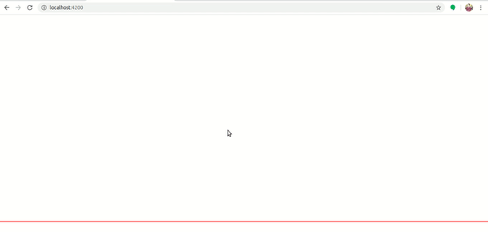
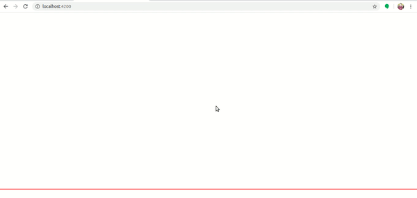
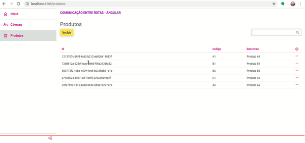

# Comunicação entre Rotas em Angular

Projeto gerado com [Angular CLI](https://github.com/angular/angular-cli) versão 9.1.7.
Adicionado [PO UI](https://po-ui.io/) versão 2.4.1 e [Web Backend API](https://www.npmjs.com/package/web-backend-api) versão 0.0.19.

## Servidor de desenvolvimento

Execute `ng serve` para iniciar o servidor local de desenvolvimento. Navegue até `http://localhost:4200/`. A aplicação vai automaticamente recarregar quando houver atualizações no código fonte.

## Parâmetros via URL: path com utilização de Resolve

Há um exemplo de cadastro simples de Clientes que utiliza a passagem de parâmetro entre rotas (path) e o conceito de Resolve para carregamento dos dados antes de efetivamente ativar a rota. Com as requisições para o backend fictício sendo realizadas com o cabeçalho que indica a apresentação do Loading, a navegação entre listagem, edição, exclusão, ocorrem de forma fluída.

## Parâmetros via URL: query param

Há um exemplo de listagem de Produtos que utiliza a passagem de parâmetro entre rotas (query param) para aplicação automática de um filtro rápido na consulta.

## Parâmetros via State

Há um exemplo de inclusão de Produto que, ao retornar para a tela de listagem quando a inclusão é efetuada com sucesso, realiza a passagem de parâmetro entre rotas (state) com o produto incluído para a tela de listagem, onde é apresentado um widget com as informações do produto.

